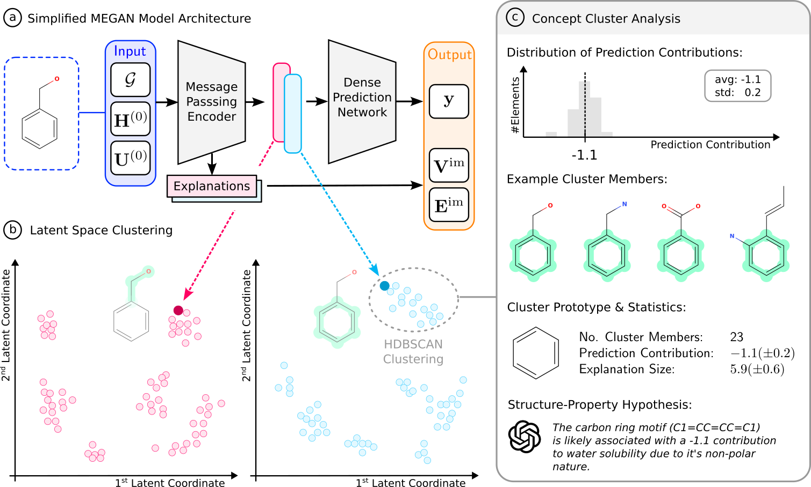

|made-with-python| |python-version| |version|

.. |made-with-python| image:: https://img.shields.io/badge/Made%20with-Python-1f425f.svg
    :target: https://www.python.org/

.. |python-version| image:: https://img.shields.io/badge/Python-3.8.0-green.svg
    :target: https://www.python.org/

.. |version| image:: https://img.shields.io/badge/version-0.2.1-orange.svg
    :target: https://www.python.org/

==============================================================================
Global Concept-Explanations for the Self-Explaining MEGAN Graph Neural Network
==============================================================================

This package implements the functionality needed to extract global concept-based explanations from the recently published 
MEGAN (`GitHub <https://github.com/aimat-lab/graph_attention_student>`_, `paper <https://link.springer.com/chapter/10.1007/978-3-031-44067-0_18>`_) 
graph neural network model. The MEGAN model itself is a self-explaining graph neural network, which is able to
provide local attributional explanations its own predictions through an attention mechanism. By extending it's architecture and 
training process, it is possible to additionally extract concept-based explanations from it's latent space of explanation embeddings.
These concept explanations provide a *global* understanding of the model's decision making process.

**Abstract.** Besides improving trust and validating model fairness, xAI
practices also have the potential to recover valuable scientific insights in
application domains where little to no prior human intuition exists. To
that end, we propose a method to create global concept explanations for
graph prediction tasks with the ultimate objective of gaining a deeper
understanding of graph predictive tasks, such as chemical property 
predictions. To achieve this we introduce the updated Megan2 version
of the recently introduced multi-explanation graph attention network.
Concept explanations are extracted by identifying dense clusters in the
model’s latent space of explanations. Finally, we optimize sub-graph 
prototypes to represent each concept cluster and optionally query a language
model to propose potential hypotheses for the underlying causal 
reasoning behind the identified structure-property relationships. We conduct
computational experiments on synthetic and real-world graph property
prediction tasks. For the synthetic tasks we find that our method correctly 
reproduces the structural rules by which they were created. For
real-world molecular property regression and classification tasks, we find
that our method rediscovers established rules of thumb as well as 
previously published hypotheses from chemistry literature. Additionally, the
concepts extracted by our method indicate more fine-grained resolution
of structural details than existing explainability methods. Overall, we
believe our positive results are a promising step toward the automated
extraction of scientific knowledge through AI models, suitable for more
complex downstream prediction tasks in the future

=======
🔔 News
=======

- **March 2024** Paper is submitted to the `2nd xAI world conference <https://xaiworldconference.com/2024/>`_

========================================
❓ What are Global Concept Explanations?
========================================

*Local* explanations aim to provide additional information about individual model predictions. Although there are different forms 
of local explanations the, the most common modality is that of importance attribution masks. For graph neural networks, these masks 
are defined on the node and edge level and usually provide a 0 to 1 *importance value* of how much a certain node or edge contributed
to the final prediction. While these explanations are very useful for understanding the model's decision making process on a case by 
case basis, it is hard to understand the model's general behavior.

*Global* explanations on the other hand aim to provide a more general understanding of the model's overal decision making process. As 
with local explanations, there exist different formats in which global model information can be presented, including generative explanations,
prototype-based explanations and concept-based explanations among others.

*Concept-based* explanations are one specific form of global explanations, which try to explain a models general behavior which is aggregated 
over many individual instances. The basic idea is to identify certain generalizable *concepts* which are then connected to a certain impact 
toward the model's prediction outcome. One such concept is generally defined as a common underlying pattern that is shared among multiple instances 
of the dataset. From a technical perspective, a concept can be defined as a set of input fragments. What exactly these input fragments are differs 
between application domains. In image processing, for example, these fragments are super pixels or image segments and in langauge processing they 
can be words or phrases. In the graph processing domain, these input fragments are subgraph motifs which can be contained in multiple different 
graphs of the dataset.

=========================
📦 Installation by Source
=========================

.. code-block:: shell

    git clone https://github.com/the16thpythonist/megan_global_explanations

Then in the main folder run a ``pip install``:

.. code-block:: shell

    cd megan_global_explanations
    python3 -m pip install -e .

Afterwards, you can check the install by invoking the CLI:

.. code-block:: shell

    python3 -m megan_global_explanations.cli --version
    python3 -m megan_global_explanations.cli --help

===============
📌 Dependencies
===============

This package heavily depends on the following two packages. For the subsequent usage description for *this* package, familiarity 
with these two packages is assumed.

- `visual_graph_datasets <https://github.com/aimat-lab/visual_graph_datasets/>`_: This package implements the *visual graph dataset (VGD)* format. This is
  specific format in which datasets for the training of graph neural networks and subsequent explainability analysis can be stored. The dataset format 
  represents every dataset as a folder and every element as two separate files: A metadata JSON file and a visualization PNG file. The metadata file can 
  be used to load the full pre-processed graph structure in a dictionary format and the visualization can be used to visualize the graph as well as 
  the results of attributional explanation methods.
- `graph_attention_student <https://github.com/aimat-lab/graph_attention_student/>`_: This package implements the actual MEGAN graph neural network 
  architecture. It exposes tools to train new MEGAN models and to load pre-trained models from memory.

=============
🚀 Quickstart
=============

To create global concept explanations for a specific graph prediction tasks, it is assumed that the dataset in question already exists in the 
*visual graph dataset (VGD)* format and that an already pre-trained MEGAN model is available. The following steps illustrate the process of loading 
the dataset and the model and then extracting the concept explanations.

.. code-block:: python

    """
    This example script will load a visual graph dataset and a pre-trained model and then 
    extract the concept explanations by finding dense clusters in the model's latent space 
    of subgraph explanations. The resulting concept clustering report PDF will be saved 
    in the current working directory.
    """
    import os
    import sys
    import pathlib
    import logging
    import typing as t

    from visual_graph_datasets.config import Config
    from visual_graph_datasets.web import ensure_dataset
    from visual_graph_datasets.data import VisualGraphDatasetReader
    from graph_attention_student.torch.megan import Megan

    from megan_global_explanations.utils import EXPERIMENTS_PATH
    from megan_global_explanations.main import extract_concepts
    from megan_global_explanations.visualization import create_concept_cluster_report

    PATH = pathlib.Path(__file__).parent.absolute()

    log = logging.Logger('00')
    handler = logging.StreamHandler(sys.stdout)
    handler.setLevel(logging.INFO)
    handler.setFormatter(logging.Formatter())
    log.addHandler(handler)

    # ~ required parameters

    # The "ensure_dataset" method will try to download a dataset from the remote file 
    # share server if it is not already present. If the dataset is already present, 
    # the local version will be used. In any case, the function will return the absolute 
    # string path to the dataset folder. 
    DATASET_PATH: str = ensure_dataset('rb_dual_motifs', Config().load())
    # Knowing the exact type of task (regression or classification) is important for 
    # various operations during the concept clustering and report generation!
    DATASET_TYPE: t.Literal['regression', 'classification'] = 'regression'
    # We also need to load an existing model, from whose latent space the concept 
    # explanations will be extracted.
    MODEL_PATH: str = os.path.join(
        EXPERIMENTS_PATH, 
        'assets', 
        'models', 
        'rb_dual_motifs.ckpt'
    )
    # This is a dictionary that provides additional information about the channels that 
    # the model uses.
    # However, this dict is optional and does not necessarily have to be provided for the 
    # concept clustering to work.
    CHANNEL_INFOS: t.Dict[int, dict] = {
        0: {'name': 'negative', 'color': 'skyblue'},
        1: {'name': 'positive', 'color': 'coral'},
    }

    # ~ loading the dataset
    # The dataset is assumed to be in the special "visual graph dataset (VGD)" format. 
    # The special "VisualGraphDatasetReader" class will be used to load the dataset. 
    # The "read" method will return a dictionary with the dataset elements and their 
    # indices as keys.
    reader = VisualGraphDatasetReader(path=DATASET_PATH)
    index_data_map: t.Dict[int, dict] = reader.read()
    processing = reader.read_process()
    log.info(f'loaded dataset with {len(index_data_map)} elements.')

    # ~ loading the model
    # The model is assumed to be a MEGAN model. Therefore the "Megan" class will be 
    # used to load the model from the given checkpoint file. The "load_from_checkpoint" 
    # method will return the model instance.
    model = Megan.load_from_checkpoint(MODEL_PATH)
    log.info(f'loaded model {model.__class__.__name__} with {model.num_channels} channels.')

    # ~ extracting the concept explanations
    # The extract_concepts method will extract the concept explanations by finding 
    # dense clusters in the the latent space of the model.
    concepts: t.List[dict] = extract_concepts(
        model=model,
        index_data_map=index_data_map,
        processing=processing,
        # parameters for the HDBSCAN clustering algorithm. The smaller the "min_samples" 
        # parameter the more concept clusters will be found. However, this will also lead 
        # to more redundancy - there might be multiple clusters for the same true motif.
        min_samples=60,
        min_cluster_size=10,
        dataset_type=DATASET_TYPE,
        channel_infos=CHANNEL_INFOS,
        # optimization of the cluster prototypes involves more effort.
        optimize_prototypes=False,
        logger=log,
    )
    log.info(f'extracted {len(concepts)} concepts.')

    # ~ creating the report
    # The "create_concept_report" method will create a report PDF which visualizes 
    # all the information from the concept clustering. For every concept several pages 
    # with statistics, examples and descriptions will be created.

    log.info(f'creating the concept clustering report...')
    report_path: str = os.path.join(os.getcwd(), 'concept_report.pdf')
    create_concept_cluster_report(
        cluster_data_list=concepts,
        path=report_path,
        dataset_type=DATASET_TYPE,
        logger=log,
    )
    log.info(f'report @ {report_path}')

============================
🧪 Computational Experiments
============================

This package uses the `PyComex`_ framework to manage computational experiments. This means that all computational experiments
are defined as independent python modules in the ``experiments`` folder.

The following list provides an overview and description of the most important experiments:

- ``vgd_concept_extraction.py``: The base implementation for the concept clustering process based on a visual graph dataset 
  and a pre-trained ``Megan`` model. Depending on the parameter configuration, this experiment will perform the HDBSCAN based 
  clustering, the optimization of the prototypes and the query to the GPT4 API to obtain a concept hypothesis.
- ``vgd_concept_extraction__ba2motifs.py``: The specific implementation of the concept extraction for the synthetic graph classification 
  dataset BA2Motifs.
- ``vgd_concept_extraction__rb_dual_motifs.py``: The specific implementation of the concept extraction for the RbDualMotifs 
  synthetic graph regression dataset. 
- ``vgd_concept_extraction__aqsoldb.py``: The specific implementation for the AqSolDB dataset. This dataset is about the regression 
  of the experimentally determined logS water solubility values of molecular graphs.
- ``vgd_concept_extraction__mutagenicity.py``: The specific implementation for the Mutagenicity dataset. This dataset is about the 
  the binary classification of whether a given molecular graph is mutagenic (causes mutations in the DNA of living organisms) or not.

- ``explain_element.py``: This experiment loads a given visual graph dataset, a pre-trained MEGAN model and the persistently stored 
  information about a concept clustering to create the local explanation for a specific element. The model is queried with the given 
  graph element as an input. The model outputs the primary target value prediction as well as the local explanation masks. Additionally, 
  the graph embeddings created by the model are used to create
- ``explain_element__aqsoldb.py``: Uses a pre-trained model and existing concept clustering to generate explanations about water solubility 
  for a single molecular graph in SMILES representation.

==========================
📎 Supplementary Materials
==========================

The repository contains the ``supplementary`` folder which includes the supplementary materials for the `paper <arxiv>`_. This folder 
contains the following elements:

- ``cluster_report_rb_dual_motifs.pdf``: The automatically generated concept clustering report PDF for the RbDualMotifs dataset that is 
  referenced in the paper.
- ``cluster_report_mutagenicity.pdf``: The automatically generated concept clustering report PDF for the Mutagenicity dataset that is 
  referenced in the paper.
- ``cluster_report_aqsoldb.pdf``: The automatically generated concept clustering report PDF for the AqSolDB dataset that is referenced 
  in the paper.

==============
📖 Referencing
==============

If you use, extend or otherwise mention or work, please cite the paper as follows:

.. code-block:: bibtex

    @article{teufel2024meganGlobal
        title={Global Concept-Explanations for the Self-Explaining MEGAN Graph Neural Network},
        author={Teufel, Jonas and Friederich, Pascal},
        journal={arxiv},
        year={2024}
    }

=======
Credits
=======

* PyComex_ is a micro framework which simplifies the setup, processing and management of computational
  experiments. It is also used to auto-generate the command line interface that can be used to interact
  with these experiments.

.. _PyComex: https://github.com/the16thpythonist/pycomex.git
.. _MEGAN: https://link.springer.com/chapter/10.1007/978-3-031-44067-0_18 